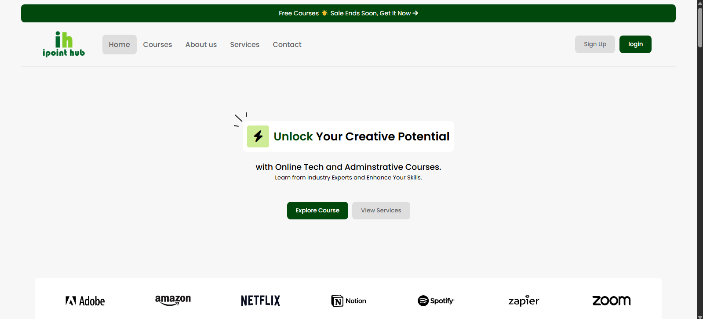
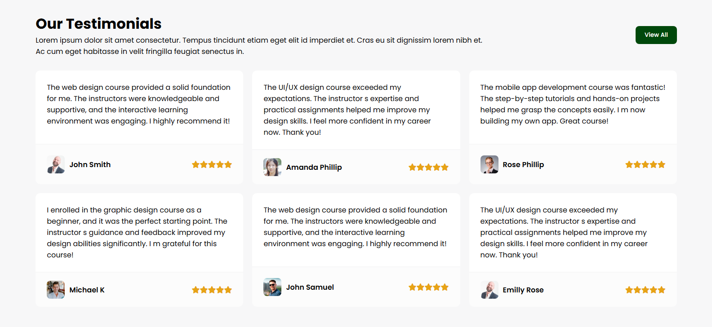

# 🖥️ iPoint Hub Website

Welcome to the official static landing page for **iPoint Hub** — a tech and administrative learning platform offering high-quality courses from industry experts.

This project is built using **only HTML, CSS, and JavaScript** (no frameworks), and it showcases a modern, responsive, and clean design suitable for learning platforms, portfolios, or service-based websites.

---

## 📸 Screenshots



---


---




### ✅ Hero Section & Navigation  
- Clean top bar with a promotion banner.  
- Responsive nav menu with logo, menu links, and login/signup buttons.  
- A call-to-action hero section encouraging visitors to "Unlock Your Creative Potential".

### ✅ Courses Section  
- A featured list of popular courses.  
- Each course card includes duration, level, tutor name, description, and a CTA ("Get it Now" button).  
- Designed for responsiveness and clarity.

---

## 🔧 Technologies Used

- **HTML5** – Semantic structure.
- **CSS3** – Responsive layout, cards, buttons, and animations.
- **Vanilla JavaScript** – Used for interactivity (e.g., future dynamic features like toggle menus, accordion, etc.).

---


## 💡 How to Use

1. Clone or download the project:
   ```bash
   git clone https://github.com/your-username/ipoint-hub.git
   ```
2. Open `index.html` in any browser.
3. Customize the content or styles as needed.

---


## 📬 Contact

Built with ❤️ by <a href=''>Diamond Alex</a> 
Feel free to reach out for collaborations or suggestions.
